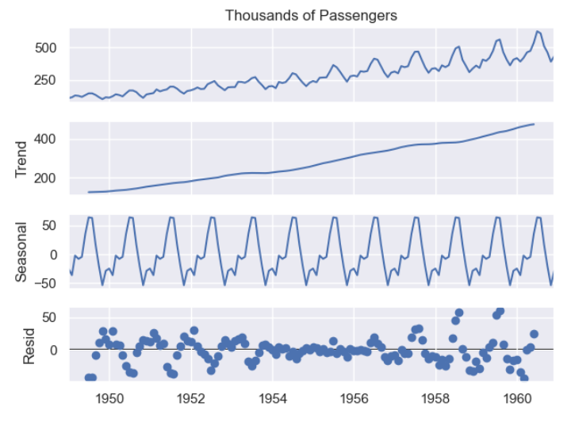
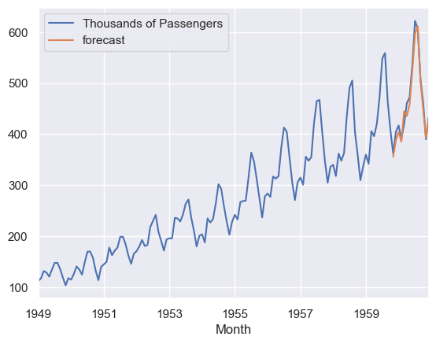
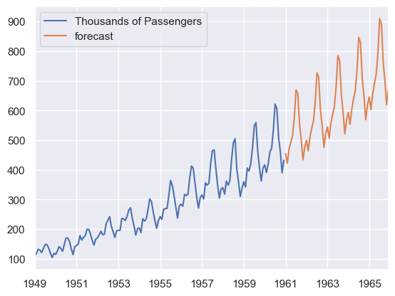
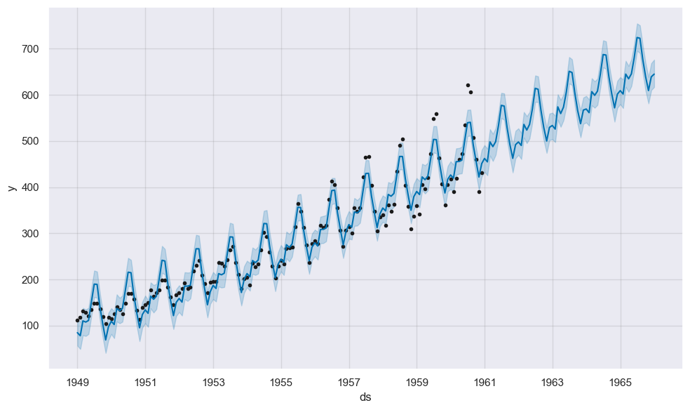
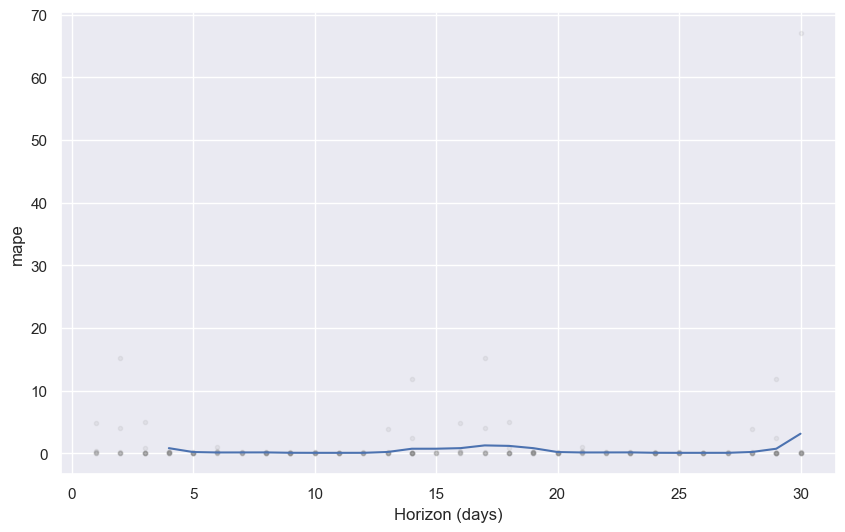

# Airline Passengers Time Series Analytics & Forecasting
A Time Series Forecasting Problem predicting the future Airline passengers based on historic data.

## Table of Contents
- Project Overview
- Problem Statement
- Data
- Challenge
- Approach
- Results

## Project Overview
- This project aims to construct a resilient time series forecasting model, leveraging historical data, to accurately predict future airline passenger counts. By harnessing advanced analytics and machine learning techniques, this initiative seeks to optimize resource utilization, streamline schedules, and enhance the overall travel experience. The project's core objective is to deliver a reliable forecasting solution that empowers stakeholders in making informed decisions and proactively addressing the challenges posed by the ever-evolving airline industry.
- The Project Notebook is available at [Jupyter Project Notebook](https://github.com/Shinde-Siddhant/Airline-Passenger-Forecasting_ARIMA-Facebook-Profet/blob/main/Project%20Notebook/Final_Time%20Series%20Analytics%20and%20Forecasting_Airline%20Passengers.ipynb)

## Problem Statement
- The airline industry is highly dynamic, with passenger demand fluctuating based on various factors such as seasonality, holidays, and economic conditions. Accurate forecasting of airline passenger numbers is crucial for optimizing resources, managing schedules, and ensuring a seamless travel experience for passengers. The goal of this project is to develop a robust time series forecasting model to predict future airline passenger counts based on historical data.

## Dataset
- The dataset contains 144 months data with variable "Months" and "Thousands of Passengers". Our target variable is "Thousands of Passengers".
- The dataset is available at [Dataset](https://github.com/Shinde-Siddhant/Airline-Passenger-Forecasting_ARIMA-Facebook-Profet/blob/main/Dataset/airline_passengers.csv)

## Challenge
- **Seasonality and Trends**: Time series data often exhibits repeating patterns (seasonality) and long-term trends, making it essential to identify and account for these patterns during forecasting.
- **Non-Stationarity**: The statistical properties of time series data can change over time. Non-stationarity, such as varying mean or variance, poses challenges in applying traditional forecasting methods.

## Approach
- **Understand the Domain:** Gain a thorough understanding of the airline industry, including factors influencing passenger demand (seasonality, holidays, economic conditions). Identify key performance indicators and objectives for forecasting.
- **Data Collection:** Collect historical data on airline passenger counts. Ensure the dataset is continuous and includes relevant timestamps.
- **Exploratory Data Analysis (EDA):** Conduct exploratory data analysis to understand the underlying patterns, trends, and seasonality. Visualize the time series data using plots such as line charts, **decomposition plots** and verified the **auto-correlation by Durbin Watson Tes**t.
- **Data Preprocessing:** Verifying **Stationarity** of dataset by **Augmented Dickey Fuller Test**. Handle seasonality and trends using techniques like **differencing(D/d)**. Calculated **Auto-correlation(Q/q) and Partial Auto-correlation(P/p)** for trend and seasonality.
- **Model Training and Validation:** Build the **ARIMA model** incorporating all the parameters and validated it on the existing data before predicting the future five years data. Also Build the **Facebook Profet model** and validated with cross-validation and performance matrix.  

## Result
- Our predictive model demonstrated promising results in predicting the future passengers.

 

 